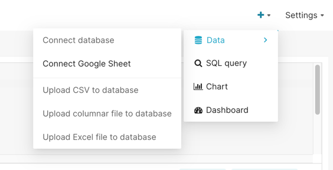
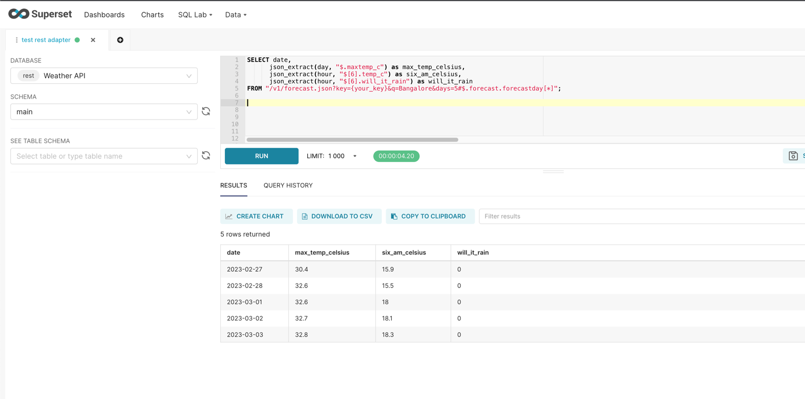

# REST-DB-API  
  
This is a plugin to be used with apache-superset, for integrating with REST APIs.

This converts REST APIs to be used as db-api in python, and builds on top of [shillelagh's](https://github.com/betodealmeida/shillelagh) generic json adapter.

To get started, just do:
```bash
pip install rest-db-api
```

Motivation
1. Generic json adapter did not support request bodies and headers.
2. Independance to specify http/https
4. `rest` dialect enables this adapter to be used with apache superset. 
5. Dialect also enables us to set a base URL, and query multiple endpoints with the same 'connection'.


# Examples

#### GET requests
Querying [weather api](https://www.weatherapi.com/)

Lets assume I am querying for 3 days weather foreacast for Bangalore. The response gives the results by hour. You can get a free key from 
```curl
https://api.weatherapi.com/v1/forecast.json?key={{your_api_key}}&q=Bangalore&days=3&aqi=no&alerts=no
```

You can refer [this file](http://somelink.com) to check the response structure.
We can query this with rest-db-api:
```python
from sqlalchemy import create_engine  
from restDbApi.utils import get_virtual_table  
  
engine = create_engine("rest://api.weatherapi.com?ishttps=1")  
  
endpoint = '/v1/forecast.json'  
params = {  
    'key': 'your_key',  
    'q': 'Bangalore',  
    'days': 5  
}  
jsonpath = "$.forecast.forecastday[*]"  
virtual_table = get_virtual_table(endpoint=endpoint,  
                                  params=params,  
                                  jsonpath=jsonpath)  
connection = engine.connect()  
for i in connection.execute(f'SELECT * FROM "{virtual_table}"'):  
    print(i)
```

The response should return an array of objects/primitives. If not, we need to specify where in the response the array is (using `jsonpath`). In this case that is at `$.forecast.forecastday[*]`

Now, as the shillelagh's `Adapter` class uses in memory storage - `sqllite` , we can query the data using `sqllite` syntax, like querying inside a nested JSON:
```python
query = f"""  
SELECT  
  date,
  json_extract(day, "$.maxtemp_c") as max_temp_celsius,  
  json_extract(hour, "$[6].temp_c") as six_am_celsius,  
  json_extract(hour, "$[6].will_it_rain") as will_it_rain
FROM  
  "{virtual_table}"  
"""  
for i in connection.execute(query):  
    print(i)
```

#### POST request with headers and request body

Consider this sample request
```javascript
curl --location -g --request POST 'https://some.api.com/some/api/path?a=60&c=someQuery&b=-50#$[*]' \
--header 'Content-Type: application/json' \
--header 'IAM_ID: satvik' \
--header 'ENVIRONMENT: staging:1.5.3' \
--header 'NAME: MY-REST-SERVICE' \
--data-raw '{
    "name": "satvik",
    "interests": [
        {
            "name": "badminton",
            "category": "sports",
            "stats": {
                "racket": "intermediate",
                "shuttle": "yonex mavis 500"
            }
        },
        {
            "name": "programming",
            "category": "computers",
            "stats": {
                "laptop": "yw",
                "mouse": "5D ergonomic",
                "keyboard": "broken"
            }
        }
    ]
}'
```

To query this with db-api, follow the snippet:
```python
from sqlalchemy import create_engine  
from restDbApi.utils import get_virtual_table
  
engine = create_engine("rest://some.api.com?ishttps=1")

endpoint = '/some/api/path'

params = {
	"a": 60,
	"b": -50,
	"c": "someQuery"
}

headers = {  
    'Content-Type': 'application/json',  
    'IAM_ID': 'satvik',  
    'ENVIRONMENT': 'staging:1.5.3',  
    'NAME': 'MY-REST-SERVICE',  
}  
  
body = {  
  "name": "satvik",  
  "interests": [  
    {  
      "name": "badminton",  
      "category": "sports",  
      "stats": { "racket": "intermediate", "shuttle": "yonex mavis 500" }  
    },  
    {  
      "name": "programming",  
      "category": "computers",  
      "stats": {  
        "laptop": "mac book pro",  
        "mouse": "5D ergonomic",  
        "keyboard": "broken"  
      }  
    }  
  ]  
}  

jsonpath = "#$[*]" # set this according to your response  

virtual_table = get_virtual_table(endpoint=endpoint,  
								  params=params,
                                  headers=headers,  
                                  body=body,  
                                  jsonpath=jsonpath)  
  
for i in connection.execute(f'SELECT * FROM "{virtual_table}"'):  
    print(i)
```

#### Usage with apache-superset
1. Go to Connect database
	
2. Select Shillelagh
3. add the connection string with `rest://` prefix
   eg: `rest://api.weatherapi.com?ishttps=1`
4. Gice your connection a name: eg `Weather API`
1. Click test connection and then add
2. Go to SQL lab and select `Weather API` from database.
3. You can leave schema empty and query directly!

Query is:
```SQL
SELECT date, 
      json_extract(day, "$.maxtemp_c") as max_temp_celsius,
      json_extract(hour, "$[6].temp_c") as six_am_celsius,
      json_extract(hour, "$[6].will_it_rain") as will_it_rain
FROM "/v1/forecast.json?key={your_key}&q=Bangalore&days=5#$.forecast.forecastday[*]";
```
Tables and schema is empty, because there's no concept for tables in REST APIs. 
It returns a default message. That message is configured in `rest_api_dialect.py`


### Getting the virtual table 
In the superset's SQL lab, we're directly using 
```python
/v1/forecast.json?key={your_key}&q=Bangalore&days=5#$.forecast.forecastday[*]
```
To get the similar virtual table address for your endpoint (it may have headers or even body), use the utility `restDbApi.utils.get_virtual_table` and pass in your configs. 

 - [x] POST requests (request body)  
 - [x] headers  
 - [ ] adding write support to adapter (for PUT/DELETE requests)
